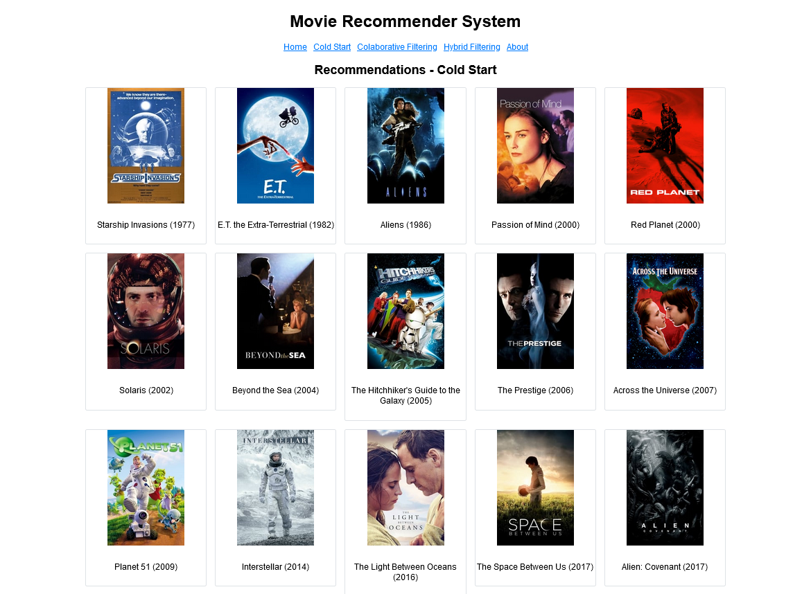

# Movie Recommendation System with Collaborative Filtering and Vector Search

This project presents a movie recommendation system using both collaborative filtering and vector search techniques to recommend movies to users. The core dataset consists of **11,506 American movies** released between **1970 and 2023**, with ratings from **11,675 users**. This framework offers personalized recommendations while addressing the cold-start problem through vector search.




## **Data:**

* **Source:** 
    * Movie titles, cast & crew, and year: Self-collected from Wikipedia  [https://en.wikipedia.org/wiki/Lists_of_American_films](https://en.wikipedia.org/wiki/Lists_of_American_films).
    * Movie IDs, genres, and ratings: Collected using The Movie Database API and cleaned (details in [01_Data_Acquisition_and_Cleaning.ipynb](./01_Data_Acquisition_and_Cleaning.ipynb)).

* **Datasets:**
    * Movies: [/data/movies.csv](./data/movies.csv)
    * Ratings: [/data/ratings_cleaned.csv](./data/ratings_cleaned.csv)
* **Preprocessing:** Analysis of missing values and outlier handling can be found in [01_Data_Acquisition_and_Cleaning.ipynb](./01_Data_Acquisition_and_Cleaning.ipynb).
* **Exploratory Data Analysis**
Analyzing the data revealed a **highly sparse utility matrix**, where a significant portion of users haven't rated many movies. This sparsity can pose challenges for traditional collaborative filtering techniques, as they rely on sufficient user-movie interactions for accurate recommendations.

To address this challenge, I explored two solutions:

1. **Vector Embeddings**: I employed the Sentence Transformer model to create vector representations for movies and users. These embeddings capture semantic information beyond explicit ratings, enabling similarity comparisons even for unseen movies or users (cold-start problem).
2. **Hybrid Filtering (Under Development)**: I investigated combining collaborative filtering with content-based filtering, which recommends movies based on their similarity to movies the user has enjoyed. This approach leverages both user-movie interactions and movie features to potentially improve recommendation accuracy.

For detailed analysis and results, please refer to my notebook: [02_Exploratory_Data_Analysis.ipynb](02_Exploratory_Data_Analysis.ipynb).


## **Vector Search for Cold-Start**

**Database**

* **Chroma DB**, an open-source vector database specifically designed for storing and retrieving vector embeddings.

**Implementation:**

* To integrate vector search into my recommendation system, I followed these steps:
    1. **Movie and User Embeddings:**
        * I used the **Sentence Transformer** model `all-MiniLM-L6-v2` to generate **vector embeddings** for movie features. These embeddings capture the semantic meaning of each entity and allow for similarity comparisons.
        * You can find the details of this process in notebook [03_Content_Embedding-Cold_Start.ipynb](03_Content_Embedding-Cold_Start.ipynb).
    2. **Chroma DB Integration:**
        * I stored the generated movie and user embeddings in Chroma DB. This enables efficient retrieval of similar movies based on a user's profile or a target movie (when dealing with cold-start scenarios).

**Impact:**
* By utilizing vector search, I was able to:
    * Recommend relevant movies to users who haven't rated many movies yet (cold-start problem).
    * Improve the overall recommendation by considering not only user-movie interactions but also the content similarity between movies.
    * Mitigate posterior collapse in recommender systems by efficiently retrieving similar items or users based on their embeddings or representations.


## **Collaborative Filtering**

* **Algorithm:** Benchmarked various collaborative filtering algorithms from the scikit-surprise library.

* **Evaluation:** Evaluated model performance using metrics like RMSE. SVD++ exhibited the lowest RMSE among the algorithms tested, indicating better prediction accuracy.

* **Hyperparameter Tuning:** Employed `GridSearch`, I fine-tuned hyperparameters such as latent factors and regularization terms.

## **Flask App**

- **Download this repository:** Clone or download this repository to your local machine.
  
- **Create new environment:** Set up a new Python environment using virtualenv or conda to manage dependencies.

- **Install requirements:** Navigate to the root directory of the downloaded repository and install the required packages by running:
  ```bash
  pip install -r requirements.txt
  ```

- **Run the Flask app:** 
  - Navigate to the root directory.
  - Run the following command to start the Flask app:
    ```bash
    python -m flask --app movies run
    ```
  - This command will launch the Flask app, and you can access it in your web browser at the specified address.


## Future Work: Enhanced Recommendations with Hybrid Filtering

I'm currently developing a hybrid filtering approach using LightFM, combining the strengths of collaborative and content-based methods to **boost recommendation accuracy, diversity, and personalization**.

**Expected Benefits:**

* **More accurate recommendations:** Leveraging both user interactions and item features for improved prediction, especially for users with limited data.
* **Wider range of relevant suggestions:** Exploring item characteristics to introduce diverse and interesting recommendations.
* **Greater personalization:** Tailoring recommendations to individual preferences and interests for enhanced user experience.
* **Increased robustness and flexibility:** Adapting to various data types and recommendation scenarios through combined techniques.


## **Technologies:** 
- pandas
- scikit-surprise
- Flask
- Chroma DB
- Sentence-Transformers

 **Dataset:** You can download it from `data` folder.

